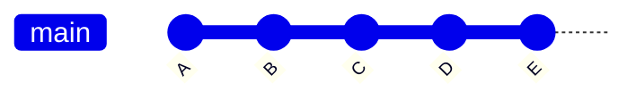

Gitでコミットした後にそのコミットの変更点を見たいときは`git diff HEAD^`とすることで見ることができます。
しかし、過去のコミットの場合は`git diff <sha1>^`としても見れないので、`git diff <sha1>^ <sha1>`や`git diff <sha1>^..<sha1>`とする場合が多いと思います。

今回は、過去のコミットの場合でも`HEAD`の場合と同程度に簡潔に表記できる省略表記について記事にしようと思います。

## 例

次のダイアグラムを使って説明します。



`HEAD`が`E`のときに`B`から`C`の変更点を見たい場合は:

```sh
git diff C^ C
```

とすることで見ることができますが、同じSHA-1のハッシュ値を2回指定するのは面倒なように思います。

そのような場合に次の省略表記を利用することができます:

```sh
git diff C^!
```

変更点を見たいコミットのハッシュ値の後に`^!`を付けることでそのコミットの変更点だけを見ることができます。

## 詳細

この省略表記はリファレンスマニュアルの`gitrevisions(7)`で説明されています。

> The _r1^!_ notation includes commit _r1_ but excludes all of its parents. By
> itself, this notation denotes the single commit _r1_.

https://git-scm.com/docs/gitrevisions#_other_rev_parent_shorthand_notations

マニュアルの説明の通り、接尾辞 _^_ に続けて感嘆符を付けると、そのコミットを指定した上でそのコミットの全ての親に接頭辞 _^_ を付けて除外するのと同じになります。

従って、以下は全て同じ意味になります:

- `git diff C^!`
- `git diff C ^C^@`
- `git diff C ^C^1`
- `git diff C ^B`

`C^@`はそのコミットの全ての親を表す省略表記で、この場合は`B`と`A`を表します。

この省略表記は`git log`でも利用でき、`git log C^!`は`git log -1 C`と同じ意味になります。

## 終わりに

過去のあるコミットの変更点を見たいときに便利な省略表記を紹介しました。
過去のあるコミットの変更点を見たい場合は結構あるように思うので、この省略表記は役に立つことが多いように思います。
