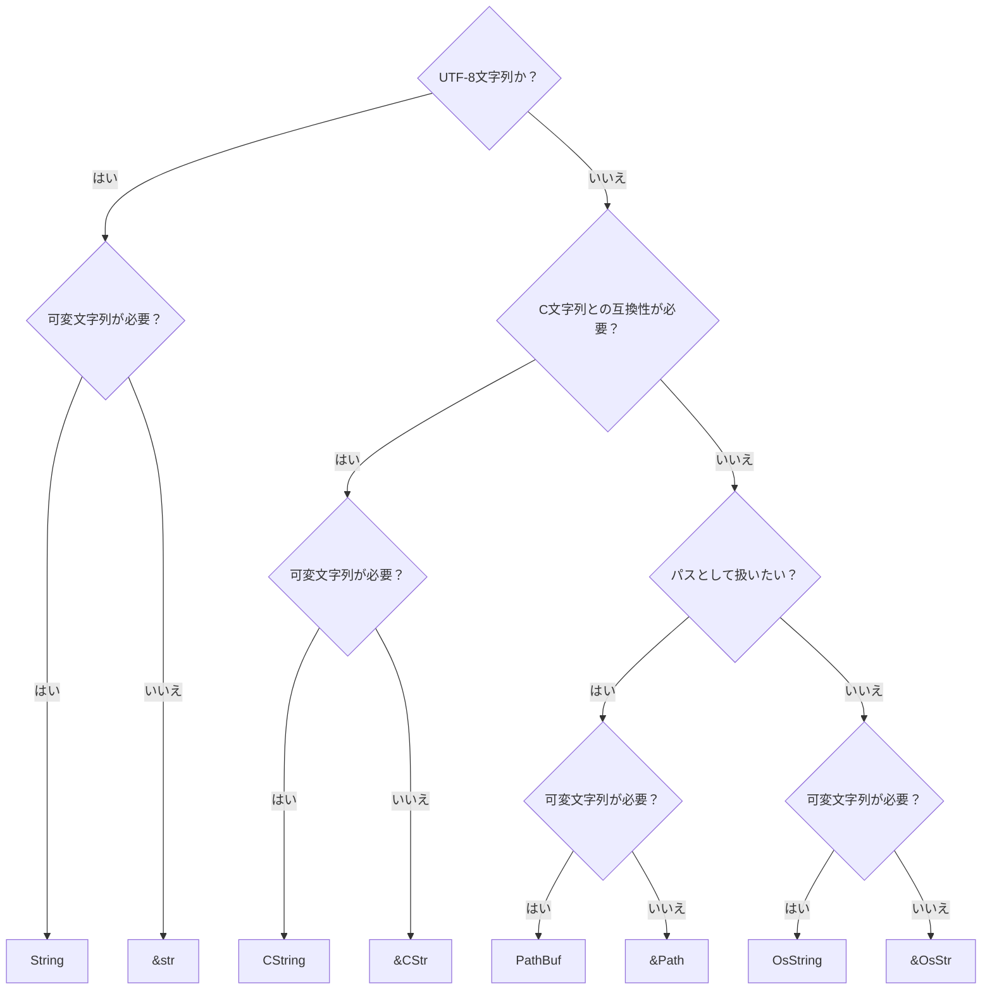

## はじめに

Rustは標準ライブラリだけでも多くの文字列型があり、他のプログラミング言語と比べて複雑になっていると思うので、自分なりにまとめてみました。

## Rustの文字列型

Rustの文字列型は以下の3種類があります:

1. UTF-8文字列型
2. プラットフォーム固有の文字列型
3. ヌル終端文字列型（C文字列型）

更にそれぞれの型は伸長や変更ができる所有権のある型と、サイズが固定で変更ができないスライス型に分かれています。
後者は通常は参照型として扱います。

## UTF-8文字列型

UTF-8文字列型はUTF-8でエンコードされた文字列を表し、安全なRustでは常に有効なUTF-8のバイト列であることが保証されています。
UTF-8文字列型には所有権のある[`String`](https://doc.rust-lang.org/std/string/struct.String.html)と参照型として扱う[`str`](https://doc.rust-lang.org/std/primitive.str.html)があります。
この記事で登場する型の中で`str`だけがプリミティブ型で、それ以外の文字列型は全て`core`、`alloc`、`std`などの標準ライブラリで定義されている型です。

### リテラル

文字列をダブルクォート（`"`）で囲むと文字列リテラルになります[^1]:

```rust
let s: &'static str = "Hello, world!";
```

1文字のときはシングルクォート（`'`）で囲むと文字リテラルになり、ダブルクォート（`"`）で囲むと文字列リテラルになります:

```rust
let c: char = '🦀';
let s: &'static str = "🦀";
```

文字列がASCII文字だけで構成されているときは接頭辞`b`を付けるとバイト文字列リテラルになり、`u8`の配列への参照になります:

```rust
let b: &'static [u8; 13] = b"Hello, world!";
```

### 文字列操作

`String`は文字列の伸長や変更ができます:

```rust
let mut s = String::from("Hello, ");
s.push_str("world!");
assert_eq!(s, "Hello, world!");
```

## プラットフォーム固有の文字列型

プラットフォーム固有の文字列型はOS固有の文字列を表します。
ファイル名や外部コマンドの出力のようなOSが扱うUTF-8であることが保証されていない文字列を扱うときに使用します。
プラットフォーム固有の文字列型には所有権のある[`OsString`](https://doc.rust-lang.org/std/ffi/struct.OsString.html)と参照型として扱う[`OsStr`](https://doc.rust-lang.org/std/ffi/struct.OsStr.html)があります。

これらの型はUTF-8文字列型に変換できますが、UTF-8文字列として不正なバイト列なときは変換は失敗します:

```rust
let s = OsStr::from_bytes(&[0x00, 0x9f, 0x92, 0x96]);
assert!(s.to_str().is_none());
```

### パス文字列型

パス文字列型はパスを抽象的に操作するための型で、プラットフォーム固有の文字列型のラッパーです。
パス文字列型には所有権のある[`PathBuf`](https://doc.rust-lang.org/std/path/struct.PathBuf.html)と参照型として扱う[`Path`](https://doc.rust-lang.org/std/path/struct.Path.html)があります。

#### 例

```rust
let path = Path::new("/path/to/rust");
let mut path_buf = PathBuf::from("/path/to");
path_buf.push("rust");
assert_eq!(path, path_buf);

assert!(path.has_root());
```

## ヌル終端文字列型

ヌル終端文字列型はC言語の文字列と互換性があるヌル文字（`\0`）で終了する文字列を表し、安全なRustでは文字列の途中にヌル文字が含まれず、ヌル文字で終了することが保証されています。
エンコーディングがUTF-8であることは保証されていません。
ヌル終端文字列型には所有権のある[`CString`](https://doc.rust-lang.org/std/ffi/struct.CString.html)と参照型として扱う[`CStr`](https://doc.rust-lang.org/std/ffi/struct.CStr.html)があります。

### リテラル

Rust 1.77以降で接頭辞`c`を付けるとC文字列リテラルになります:

```rust
let s: &'static CStr = c"Hello, world!";
```

### 例

```rust
let s = CStr::from_bytes_with_nul(b"Hello, world!\0").unwrap();
assert_eq!(s.to_str().unwrap(), "Hello, world!");
```

## まとめ

1. RustにはUTF-8文字列型、プラットフォーム固有の文字列型、ヌル終端文字列型の3種類の文字列型がある。
2. それぞれの文字列型は更に所有権のある型と参照型に分かれている。
3. 文字列リテラルは常にシングルクォート（`'`）ではなくダブルクォート（`"`）で囲む。

### 使い分け



### 一覧表

| 型名       | 所有権 | 可変？ | 例                                |
| ---------- | ------ | ------ | --------------------------------- |
| `String`   | あり   | Yes    | `String::from("Hello, world!")`   |
| `&str`     | なし   | No     | `"Hello, world!"`                 |
| `OsString` | あり   | Yes    | `OsString::from("Hello, world!")` |
| `&OsStr`   | なし   | No     | `OsStr::new("Hello, world!")`     |
| `PathBuf`  | あり   | Yes    | `PathBuf::from("/path/to/rust")`  |
| `&Path`    | なし   | No     | `Path::new("/path/to/rust")`      |
| `CString`  | あり   | Yes    | `CString::new("Hello, world!")`   |
| `&CStr`    | なし   | No     | `c"Hello, world!"`                |

## 終わりに

Rustの文字列型についてまとめてみました。
基本的には`&str`と`String`を使って、必要になったときだけそれ以外の文字列型を使うようにするのが良さそうです。
ここまでお読みいただきありがとうございました。

[^1]: 文字列リテラルを表すのにシングルクォート（`'`）を使うことはできません。
